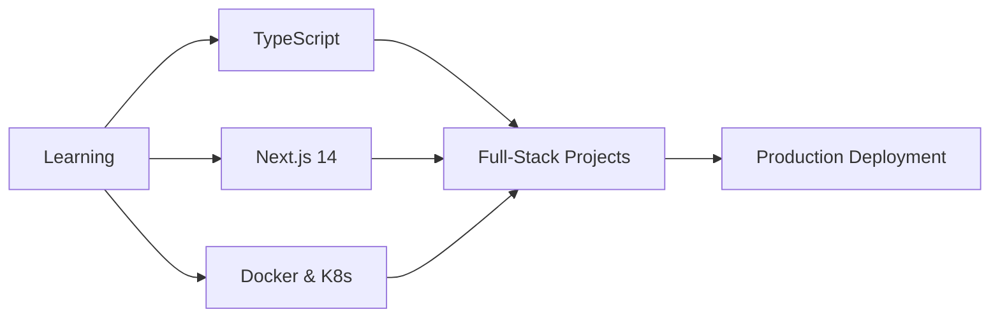

<!--
  Professional README for Harshdeep
  - Visual-first layout with guidance for images that don't render on GitHub
  - Keep this file at repo root as `Readme.md`
-->

# Harshdeep — Full-Stack Developer

[](https://linkedin.com/in/your-linkedin)
[](https://discord.com/users/your-discord-id)
[](mailto:youremail@gmail.com)
[](https://your-portfolio.com)

A pragmatic Full-Stack developer focusing on building scalable web applications and quality user experiences.

---

## 📊 GitHub Analytics & Activity

<div align="center">
  
  
  
</div>

### 📈 Contribution Graph
<p align="center">
  
</p>

### 🔥 GitHub Stats
<p align="center">
  
  
</p>

### 💻 Most Used Languages
<p align="center">
  
  
</p>

### 🏆 GitHub Trophies
<p align="center">
  
</p>

---

## What this repository contains

- A collection of web projects and demos built with React, Node.js and MongoDB.
- Clean, approachable README with visuals, badges, and troubleshooting tips for images.

## Key Features

- Responsive UI and RESTful APIs
- Authentication & role-based access (when applicable)
- Deploy-ready Docker / CI hints

## 🛠️ Tech Stack & Tools

<p align="center">
  
</p>

### Frontend


### Backend


### DevOps & Tools


---

## Quick start

1. Clone the repo

   git clone https://github.com/<your-user>/<your-repo>.git

2. Install and run (example for a Node + React monorepo)

   # from repo root
   cd project-folder
   npm install
   npm run dev

3. Open http://localhost:3000 (or as configured)

---

## How to add visuals (best practice)

1. Create a directory to store visuals inside the repo: `docs/images/` or `.github/assets/`.
2. Add images (PNG/JPG) and small GIFs for demos. Keep GIFs under ~5–10 MB for fast loading.
3. Reference them with a relative path in the README:

   ```markdown
   
   ```

4. Commit the image files to the same branch as the README so GitHub can render them.

---

## Troubleshooting: Images not visible on GitHub (common causes & fixes)

If images in your README are not appearing, check the following (in order):

1. Wrong path or filename
   - GitHub is case-sensitive. `Images/Screenshot.png` ≠ `images/screenshot.png`.
   - Use the exact relative path from the README location. If README is at repo root and image is in `docs/images/`, use `docs/images/foo.png`.

2. Image not committed / on different branch
   - Ensure the image is added and pushed to the same branch as the README.
   - Run `git status` and `git ls-files | grep docs/images` to confirm the file is tracked.

3. Using a non-raw GitHub URL
   - Browser-visible preview links (like repository HTML pages) won't always work; for raw file links use:

   https://raw.githubusercontent.com/<user>/<repo>/<branch>/docs/images/screenshot.png

   - But prefer relative paths inside README for portability.

4. External image blocked / mixed content
   - If linking to an external HTTP image from an HTTPS page, the image will be blocked. Use HTTPS.
   - Some services block hotlinking or require CORS; host images in your repo or use a CDN.

5. File size too large / LFS required
   - GitHub has limits for file size. Very large images or videos should be stored using Git LFS or a CDN.

6. Adblockers or corporate proxies
   - Some badges or analytics images can be blocked by adblockers. Test in a different browser or incognito.

7. Branch name mismatch for raw URLs
   - If you hard-coded `main` but your default branch is `master` (or vice versa), raw links will 404. Use relative paths instead.
---
 
---

## 📁 Featured Projects

<div align="center">

| Project | Description | Tech Stack | Links |
|---------|-------------|------------|-------|
| 🤖 **Adaptive Chatbot** | Full-stack chatbot with task management & conversation organization | React, Node.js, MongoDB, Express | [Code](https://github.com/24-Harshdeep/adaptuitive-chatbot) • [Demo](#) |
| 🍜 **Zaika Hub** | Recipe discovery & sharing platform with search filters | React, CSS3, REST API | [Code](https://github.com/24-Harshdeep/zaika-hub) • [Demo](#) |

</div>

## 🎯 Current Focus



## 📚 Certifications

<details>
<summary>🎓 Click to view certifications</summary>

- ✅ Prompt Engineering for ChatGPT – Coursera
- ✅ Learning to Prompt – Coursera  
- ✅ Introduction to Git and GitHub – Coursera
- ✅ Version Control – Coursera
- ✅ MongoDB & Backend Development – MongoDB University

</details>

---

## Contributing

- Fork, create a feature branch, add tests, and open a PR.
- Read `CONTRIBUTING.md` (if present) for coding and commit guidelines.

---

## License & Contact

MIT · For business or collaboration inquiries: youremail@gmail.com

---

_If you'd like, I can add a sample screenshot file (placeholder) into `docs/images/` so you can see how it renders and to remove the "missing image" problem while you replace it with real screenshots._
