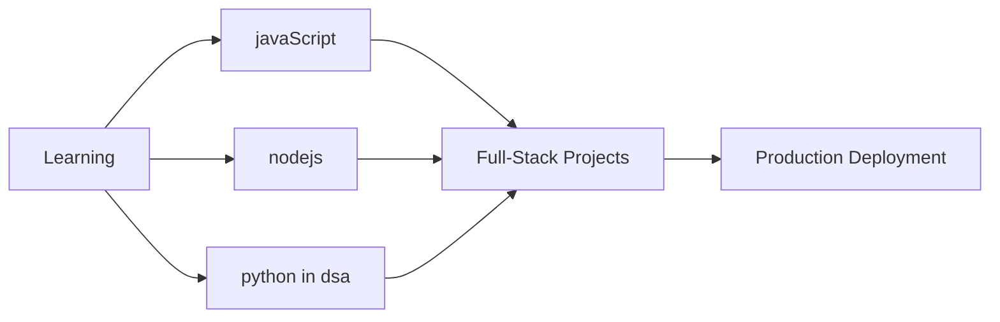

<!--
  Professional README for Harshdeep
  - Visual-first layout with guidance for images that don't render on GitHub
  - Keep this file at repo root as `Readme.md`
-->

# Harshdeep — Full-Stack Developer

A pragmatic Full-Stack developer focusing on building scalable web applications and quality user experiences.

---

## 📊 GitHub Analytics & Activity

  
  
  

### 📈 Contribution Graph

  

## 🎯 Current Focus

## 📚 Certifications

🎓 Click to view certifications

- ✅ [Prompt Engineering for ChatGPT – Coursera Certificate](https://www.coursera.org/account/accomplishments/records/XBMTKTPY0OW6)
- ✅ Learning to Prompt – Effective prompts for AI models like ChatGPT
- ✅ [Introduction to Git and GitHub – Coursera Certificate](https://www.coursera.org/account/accomplishments/records/D9E238813HKD) — Certified in foundational Git skills, including version control management and collaboration.
- ✅ [Version Control – Coursera Certificate](https://www.coursera.org/account/accomplishments/records/TW70H2NAMY2I) — Learned version control best practices and collaborative workflows.
- ✅ MongoDB & Backend Learning (examples / course links):
  - [Connecting to a MongoDB Database](https://learn.mongodb.com/c/_VQTpjFKRNSGqsOqvSOX3g)
  - [CRUD Operations: Insert and Find Documents](https://learn.mongodb.com/c/uyYeQapKTumGzcozYK7lGQ)
  - [Getting Started with MongoDB Atlas](https://learn.mongodb.com/c/oiMdaLxcTwGHll-piWyAhA)

---

## License & Contact

MIT · For business or collaboration inquiries: harshdeepkaur1208@gmail.com

---

_If you'd like, I can add a sample screenshot file (placeholder) into `docs/images/` so you can see how it renders and to remove the "missing image" problem while you replace it with real screenshots._
