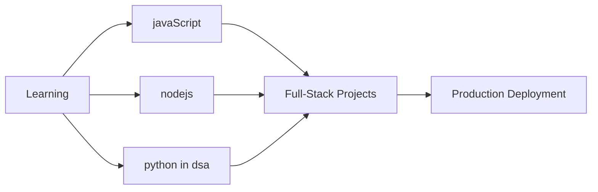
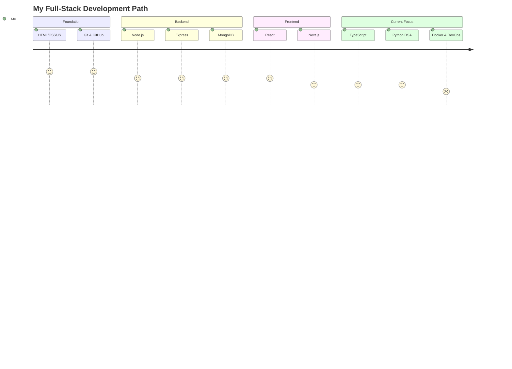

<!--
  Professional README for Harshdeep
  - Visual-first layout with guidance for images that don't render on GitHub
  - Keep this file at repo root as `Readme.md`
-->

# Harshdeep — Full-Stack Developer

Hi, I'm Harshdeep — a **Full-Stack Developer** passionate about building scalable, high-performance web applications and experimenting with AI-driven solutions.

I focus on creating clean user interfaces, efficient backend systems, and seamless integrations that bridge creativity with functionality.

### Currently exploring:

- Advanced backend patterns with **Node.js** and **Express**
- AI-powered product features using **OpenAI APIs**
- Database design and deployment optimization with **MongoDB** and **Vercel**

My development philosophy is simple — **write purposeful code, ship meaningful products, and keep learning every day.**

When I'm not coding, I'm usually refining my learning path, contributing to open-source projects, or helping others get started with modern web technologies.

---

## 📊 GitHub Analytics & Activity

  
  
  

### 📈 Contribution Graph

  

## 🎯 Current Focus

## 🎓 Certifications & Learning Path

### � Professional Certificates

<table>
<tr>
<td width="50%">

**🤖 AI & Prompt Engineering**
- ✅ [Prompt Engineering for ChatGPT](https://www.coursera.org/account/accomplishments/records/XBMTKTPY0OW6)  
  *Coursera · Mastering effective prompts for AI models*
- ✅ [Learning to Prompt](https://www.coursera.org/account/accomplishments/verify/XBMTKTPY0OW6)  
  *Coursera · Effective prompts for AI models like ChatGPT*

</td>
<td width="50%">

**🔧 Version Control & Collaboration**
- ✅ [Introduction to Git and GitHub](https://www.coursera.org/account/accomplishments/records/D9E238813HKD)  
  *Coursera · Foundational Git skills & collaboration*
- ✅ [Version Control](https://www.coursera.org/account/accomplishments/records/TW70H2NAMY2I)  
  *Coursera · Best practices & workflows*

</td>
</tr>
</table>

### 🗄️ Backend & Database

**MongoDB University**
- 🔗 [Connecting to a MongoDB Database](https://learn.mongodb.com/c/_VQTpjFKRNSGqsOqvSOX3g)
- 📄 [CRUD Operations: Insert and Find Documents](https://learn.mongodb.com/c/uyYeQapKTumGzcozYK7lGQ)
- 🚀 [Getting Started with MongoDB Atlas](https://learn.mongodb.com/c/oiMdaLxcTwGHll-piWyAhA)

---

## 🛤️ Learning Journey

---

## 📬 Let's Connect

💼 Open for collaboration on full-stack projects and open source contributions!

**Contact:** harshdeepkaur1208@gmail.com

---

  
  **💻 "Code with purpose, deploy with impact."**
  
  Made with ❤️ | Powered by ☕
  

